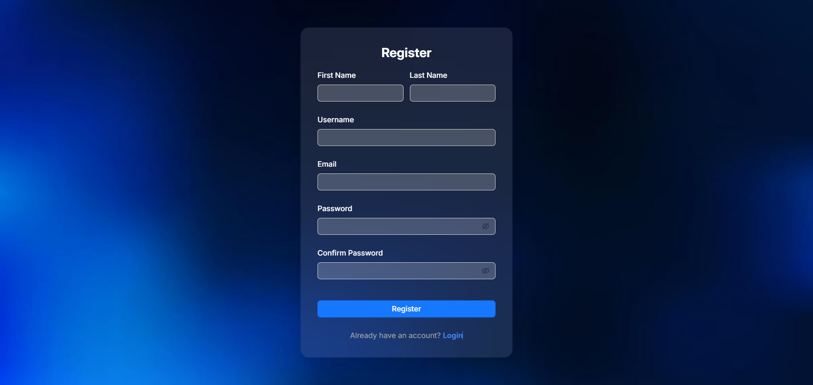
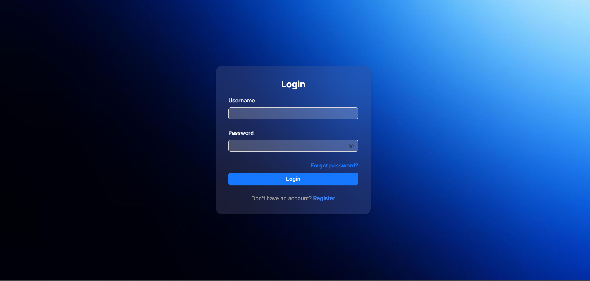
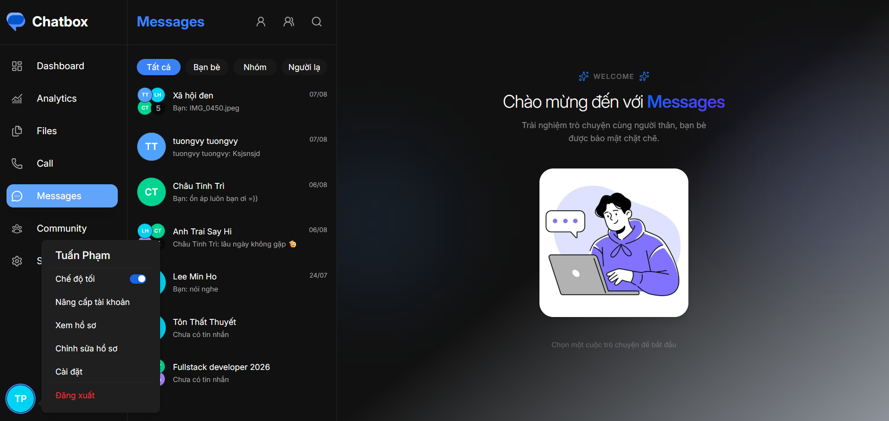
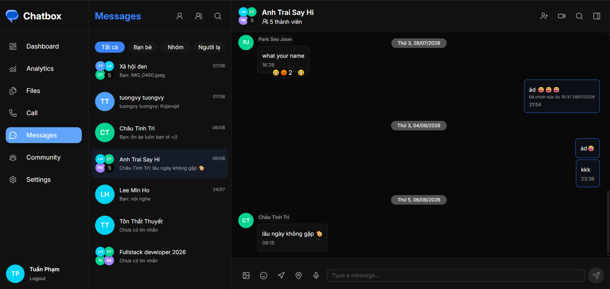
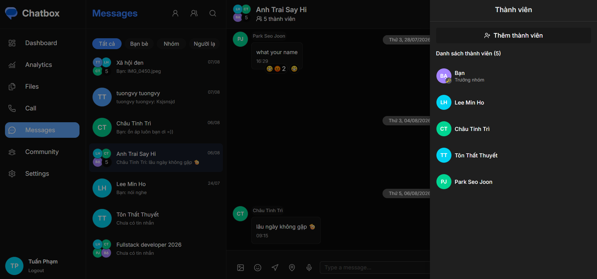
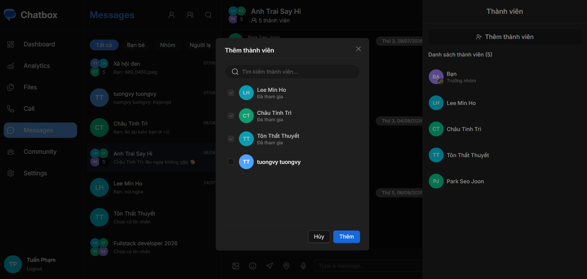
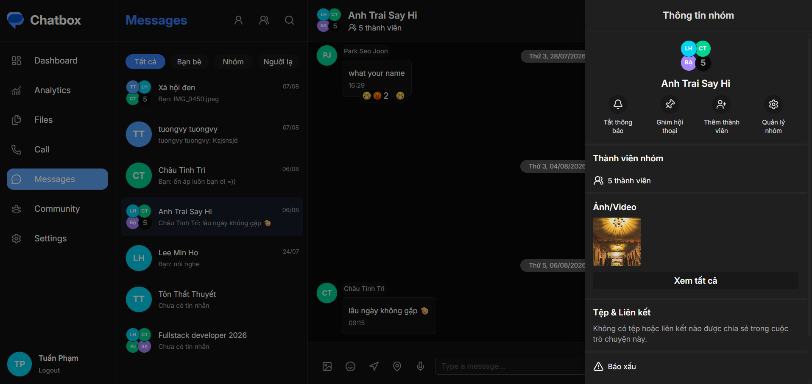
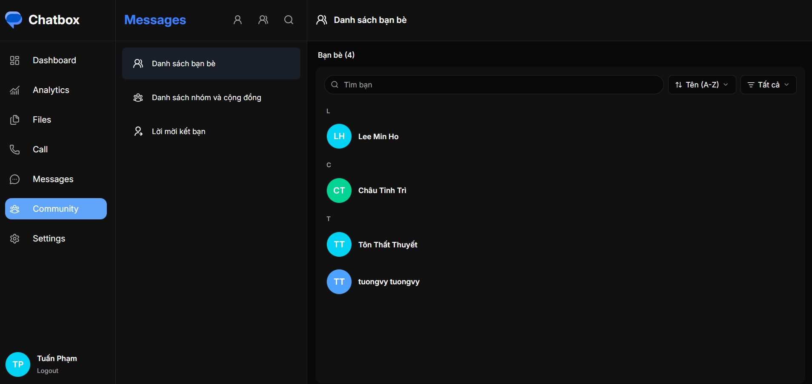
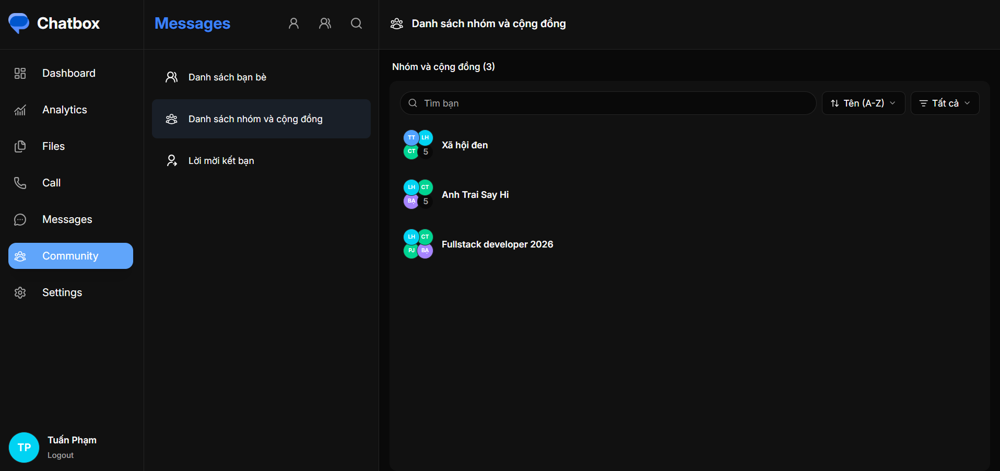
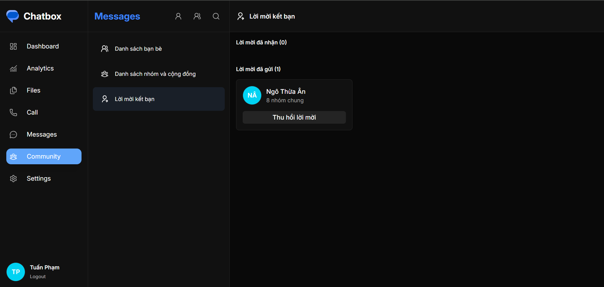

# Chat-box

## Overview

ChatBox is a full-stack real-time chat application. Users can create accounts, connect with friends, chat one-to-one or in groups, send messages and images, and see online status in real time. The project includes common features found in modern chat apps like Messenger, Zalo.

## Test Project

[Live Demo](https://chat-box-nine-kappa.vercel.app/)

---

## Features

- **User Management**: Register, login, profile management.
- **Friend Management**: Add, cancel, accept, reject request.
- **Conversations Management**:
  create one-to-one conversations,
  group chats,
  add and remove members,
  admin and member roles,
  leave or delete groups,
  last message and unread message count.
- **Messages Management**:
  Send text and image,
  edit and delete messages,
  reply to message,
  message reactions,
  sent, delivered and read status,
  infinite scroll for older messages.
- **Real-time Management**:
  Real-time messaging with Socket.IO
  Typing indicator
  Online/offline status
  Unread message tracking
  Message read status
- **Security**:
  Password hashing with bcrypt
  JWT authentication
  Refresh token
  Rate limiting for login and registration
- **UI/UX**: Skeleton UI

---

## Tech Stack

### Frontend

- `react`: Core UI library.
- `redux-toolkit`: State management.
- `antd`: Component UI library.
- `tailwindcss`: Utility-first CSS.
- `yet-another-react-lightbox`: image gallery.

### Backend

- `express`: Web server framework.
- `mongoose`: MongoDB ODM.
- `jsonwebtoken`: Authentication with JWT.
- `bcrypt`: Password hashing.
- `dotenv`: Environment configuration.
- `cloudinary`: Image storage and optimization.

---

## Installation

### Prerequisites

- Node.js (v18 or above)
- MongoDB
- Cloudinary account

### Setup Steps

1. Clone the repository
2. Install dependencies for both frontend and backend
3. Set up your `.env` files (see example below)
4. Run the frontend and backend

```bash
# Frontend
cd frontend
npm install
npm run dev

# Backend
cd ../backend
npm install
npm run dev


```

## Screenshot

### CUSTOMER

### Register



### Login



### Chat page



### Chat conversation detail









### Community page






